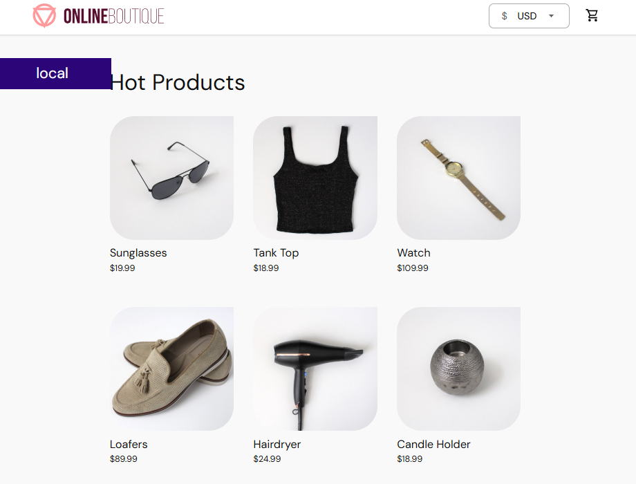

<div align="center">
  
# 🏗️ On-Prem GitOps Microservices Platform

**코드 푸시부터 빌드·배포·모니터링·알림까지 — 온프레미스 환경의 GitOps 기반 운영 파이프라인**

[](https://kubernetes.io/)
[](https://gitlab.com/)
[](https://argoproj.github.io/cd/)
[](https://prometheus.io/)
[](https://grafana.com/)
[](https://grafana.com/oss/loki/)
[](https://www.docker.com/)
[](https://helm.sh/)

</div>

---

## 💡 왜 이 프로젝트를 만들었나

온프레미스 환경에서 마이크로서비스를 운영할 때 가장 큰 문제는 **"사람이 직접 개입해야 하는 순간이 너무 많다"** 는 것입니다.

- 코드를 수정하면 → 누군가가 직접 이미지를 빌드하고 배포해야 했고
- 서비스에 이상이 생기면 → 로그를 직접 뒤져 원인을 찾아야 했으며
- 인프라 상태가 바뀌면 → 어디서 무엇이 달라졌는지 추적이 어려웠습니다

이 프로젝트는 그 수동 개입을 줄이기 위해 설계했습니다. GitOps 원칙으로 인프라를 선언적으로 관리하고, CI/CD 파이프라인으로 배포 흐름을 자동화하며, Observability 스택으로 시스템 상태를 항상 가시화합니다.

---

## 📊 Key Achievements

| 항목 | Before | After |
|------|--------|-------|
| 🚀 배포 방식 | 수동 `kubectl apply` | 코드 푸시 → 자동 빌드 · 배포 파이프라인 구축 |
| 🧩 운영 마이크로서비스 | — | 11개 서비스 동시 운영 |
| 🔍 장애 감지 | 직접 로그 확인 | Prometheus Alert → Slack 자동 알림 |
| 🔄 인프라 자가복구 | 수동 재배포 | Argo CD Self-Heal 자동 복구 |

---

## 🗺️ Architecture Overview

> 플랫폼 서버(CI/CD Hub)와 Kubernetes 클러스터(Runtime)를 명확히 분리한 전체 데이터 흐름도입니다.

[](./docs/images/mainarchitecture.png)

<details>
<summary><b>📖 흐름 요약 (클릭해서 펼치기)</b></summary>

```
Developer/Ops
  └─ git push
       └─ GitLab CI 트리거
            ├─ Docker 이미지 빌드
            ├─ GitLab Container Registry에 Push
            └─ gitops-repo 업데이트
                 └─ Argo CD (SSA 방식으로 K8s에 자동 Sync)
                      └─ Worker Node에 Pod 배포

User
  └─ HTTPS(443) 요청
       └─ MetalLB LoadBalancer
            └─ Ingress-NGINX
                 └─ Frontend Service
                      └─ gRPC → Cart / ProductCatalog / Currency / 기타 서비스

Observability
  └─ Promtail → Loki (로그 수집)
  └─ Prometheus (메트릭 스크레이핑)
  └─ Grafana (대시보드 시각화)
  └─ AlertManager → Slack (알림 Push)
```

</details>

---

## ✨ Core Features

### ① GitOps 기반 선언적 배포 자동화

GitLab CI가 이미지를 빌드해 레지스트리에 올리면, Argo CD가 gitops-repo 변경을 감지해 클러스터에 Sync합니다. `Server-Side Apply(SSA)` 방식을 적용해 선언된 상태와 실제 상태가 다를 경우 자동으로 Self-Heal합니다.

### ② MetalLB + Ingress-NGINX 트래픽 라우팅

클라우드 없이 온프레미스에서 `LoadBalancer` 타입 서비스를 사용하기 위해 MetalLB를 도입했습니다. Ingress-NGINX가 외부 트래픽을 받아 내부 마이크로서비스로 최적 경로로 전달합니다.

### ③ 중앙 집중식 Observability 스택

Promtail이 모든 Pod의 로그를 수집해 Loki로 전송하고, Prometheus가 메트릭을 스크레이핑합니다. 모든 데이터는 Grafana 대시보드에서 통합 시각화되며, 임계값 초과 시 AlertManager가 Slack으로 자동 알림을 전송합니다.

### ④ 11개 마이크로서비스 동시 운영

Google Online Boutique 기반의 11개 서비스를 kubeadm으로 구성한 온프레미스 클러스터에서 운영합니다. 서비스 간 통신은 gRPC 기반으로 처리됩니다.

---

## 🛠️ Tech Stack

| Category | Technologies |
|----------|-------------|
| Container Orchestration |   |
| CI/CD |   |
| Container |   |
| Networking |   |
| Observability |      |

---

## 🖥️ Application Screenshot

> 11개 마이크로서비스로 구동되는 Online Boutique 쇼핑몰 프론트엔드



---

## 📚 상세 문서 (Wiki)

아키텍처 설계 배경, 컴포넌트별 세부 구성, 트러블슈팅 기록은 Wiki에서 제공합니다.

| 문서 | 내용 |
|------|------|
| [🏠 Wiki Home](https://github.com/msp-architect-2026/kim-jaehoon/wiki) | 전체 문서 목차 |
| [🖥️ Infrastructure Architecture](https://github.com/msp-architect-2026/kim-jaehoon/wiki/Infrastructure-Architecture) | 클러스터 구성, 네트워크 설계 |
| [📦 Application Architecture](https://github.com/msp-architect-2026/kim-jaehoon/wiki/Application-Architecture) | 마이크로서비스 구조, gRPC 통신 |

---

<div align="center">


</div>
