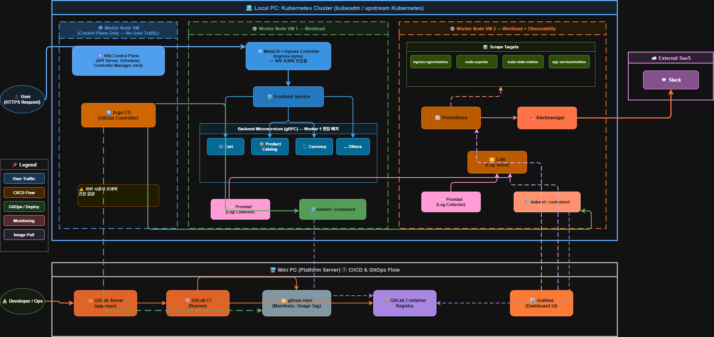

# 🏗️ On-Prem GitOps Microservices Platform
### (Google Online Boutique on Kubernetes)

## 프로젝트 소개
온프레미스 환경에서 **kubeadm 기반 Kubernetes 클러스터**를 구성하고,  
**GitLab CI + Container Registry**로 이미지를 빌드/푸시한 뒤,  
**Argo CD**가 Git 변경사항을 감지해 **자동 Sync / Self-heal**로 배포 상태를 유지하도록 구축했습니다.  
또한 **Prometheus/Loki/Grafana + Alertmanager→Slack**으로 관측·알림까지 운영 흐름으로 연결했습니다.

## 아키텍처

## Wiki (상세 문서)
구축 절차, 운영 Runbook, 트러블슈팅, 검증/증빙 스크린샷 등 상세 내용은 Wiki에서 관리합니다.
- Wiki Home: https://github.com/msp-architect-2026/kim-jaehoon/wiki
- Troubleshooting Log: https://github.com/msp-architect-2026/kim-jaehoon/wiki/TroubleshootingLog
